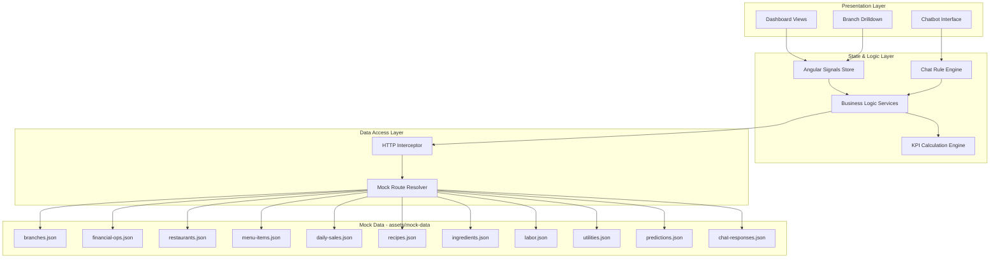
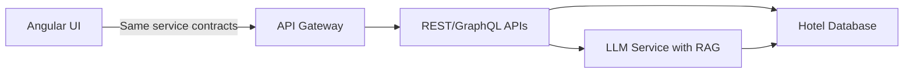
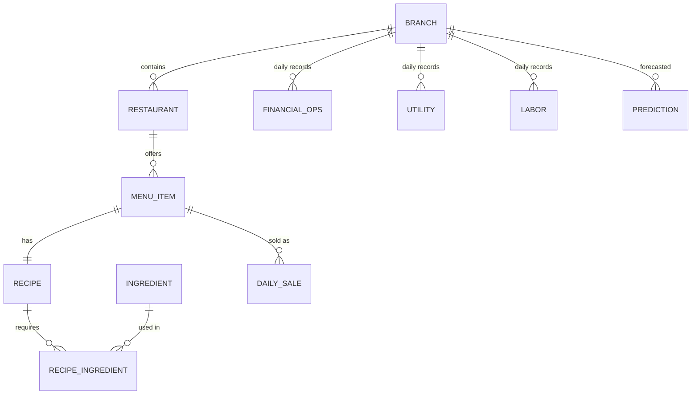
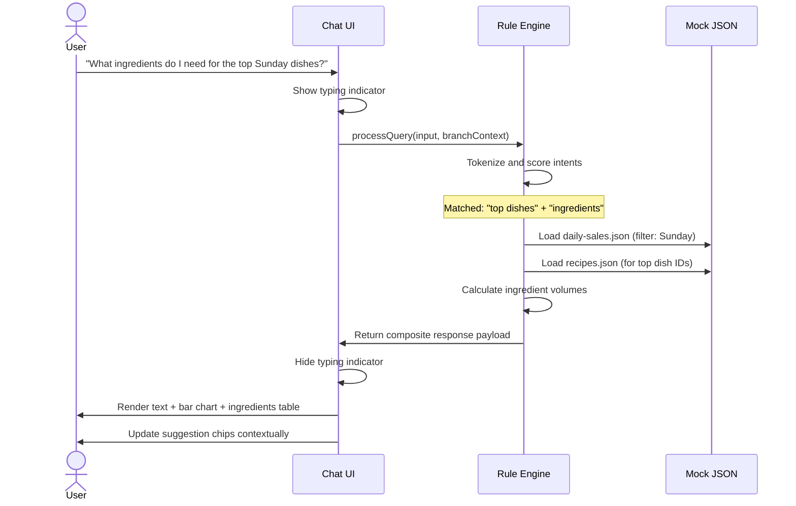

# Enterprise Hotel Management Platform — POC Design Architecture

## 1. Executive Summary

This document defines the architecture, UI design system, data model, and implementation strategy for a **Proof-of-Concept (POC)** enterprise hotel chain management dashboard with an integrated AI-powered conversational interface.

**Primary objective**: Build a visually impressive, fully interactive frontend application using mock data that demonstrates the platform's value proposition to stakeholders — compelling enough to secure approval for full-scale production development.

**Core principle**: Every architectural decision in this POC is made with production-readiness in mind. The mock data layer is designed as a clean seam that can be replaced with real APIs without refactoring the UI, services, or state management.

---

## 2. High-Level Architecture



### Future Production Path



The only change required for production: **flip the environment flag** from `useMockApi: true` to `false`. The HTTP interceptor stops intercepting, and real API calls flow through unchanged service contracts.

---

## 3. Technology Stack

| Layer | Technology | Rationale |
|---|---|---|
| **Framework** | Angular 18+ (standalone components) | TypeScript-first, modular, enterprise-proven, built-in dependency injection |
| **State Management** | Angular Signals | Lightweight, built-in, sufficient for POC scope; avoids NgRx boilerplate overhead |
| **UI Components** | Angular Material 18 | Mature sidebar, cards, tables, dialogs, tabs; accessible out of the box |
| **Styling** | Tailwind CSS 3 | Utility-first for rapid iteration; custom design tokens for brand consistency; easy dark mode via `class` strategy |
| **Charts** | Apache ECharts via `ngx-echarts` | Canvas rendering for performance; 40+ chart types; rich animation and drilldown; open source |
| **Icons** | Material Symbols (variable) | Consistent with Material Design; supports fill, weight, grade, and optical size axes |
| **Mock Server** | Angular HTTP Interceptor + local JSON | Zero external dependency; interceptor routes requests to `assets/mock-data/*.json` |
| **Build** | Angular CLI + esbuild | Fast builds; tree-shaking; production-ready output |

### Why These Over Alternatives

| Decision | Chosen | Rejected | Why |
|---|---|---|---|
| Charts | ECharts | ApexCharts | More chart types (treemap, sunburst, gauge, sankey); canvas rendering handles large datasets better; richer animation API |
| Styling | Tailwind CSS | PrimeNG themes | Smaller bundle; no vendor lock-in; full design control; faster iteration for POC aesthetics |
| Chat UI | Custom-built | Syncfusion AI AssistView | Avoids paid license; full UX control; lighter bundle; the structured JSON payload pattern works with any renderer |
| State | Signals | NgRx | POC scope doesn't need Redux-level indirection; Signals are reactive, built-in, and sufficient for branch/date/chat state |

---

## 4. Project Structure

```
hotel-analytics-poc/
├── src/
│   ├── app/
│   │   ├── app.component.ts              # Root shell: sidebar + router-outlet
│   │   ├── app.config.ts                 # Providers, interceptors, routing
│   │   ├── app.routes.ts                 # Lazy-loaded route definitions
│   │   │
│   │   ├── core/
│   │   │   ├── interceptors/
│   │   │   │   └── mock-api.interceptor.ts
│   │   │   ├── services/
│   │   │   │   ├── branch.service.ts
│   │   │   │   ├── financial.service.ts
│   │   │   │   ├── restaurant.service.ts
│   │   │   │   ├── supply-chain.service.ts
│   │   │   │   ├── labor.service.ts
│   │   │   │   ├── utility.service.ts
│   │   │   │   ├── prediction.service.ts
│   │   │   │   └── chatbot.service.ts
│   │   │   ├── models/
│   │   │   │   ├── branch.model.ts
│   │   │   │   ├── financial.model.ts
│   │   │   │   ├── restaurant.model.ts
│   │   │   │   ├── recipe.model.ts
│   │   │   │   ├── labor.model.ts
│   │   │   │   ├── utility.model.ts
│   │   │   │   └── chat.model.ts
│   │   │   └── state/
│   │   │       ├── branch.state.ts       # Selected branch signal
│   │   │       ├── date-range.state.ts   # Active date filter signal
│   │   │       └── theme.state.ts        # Dark/light mode signal
│   │   │
│   │   ├── shared/
│   │   │   ├── components/
│   │   │   │   ├── kpi-card/
│   │   │   │   ├── chart-card/
│   │   │   │   ├── data-table/
│   │   │   │   ├── branch-selector/
│   │   │   │   ├── date-range-picker/
│   │   │   │   └── theme-toggle/
│   │   │   ├── pipes/
│   │   │   │   ├── currency-short.pipe.ts
│   │   │   │   └── percentage.pipe.ts
│   │   │   └── directives/
│   │   │       └── animate-on-scroll.directive.ts
│   │   │
│   │   └── features/
│   │       ├── dashboard/
│   │       │   ├── dashboard.component.ts
│   │       │   ├── widgets/
│   │       │   │   ├── revenue-overview.component.ts
│   │       │   │   ├── occupancy-gauge.component.ts
│   │       │   │   ├── branch-comparison.component.ts
│   │       │   │   └── top-dishes.component.ts
│   │       │
│   │       ├── branch-analytics/
│   │       │   ├── branch-detail.component.ts
│   │       │   ├── financial-overview.component.ts
│   │       │   └── utility-breakdown.component.ts
│   │       │
│   │       ├── sales-insights/
│   │       │   ├── sales-trends.component.ts
│   │       │   └── dish-popularity.component.ts
│   │       │
│   │       ├── supply-chain/
│   │       │   ├── ingredient-tracker.component.ts
│   │       │   └── procurement-forecast.component.ts
│   │       │
│   │       ├── labor/
│   │       │   ├── staffing-overview.component.ts
│   │       │   └── shift-planner.component.ts
│   │       │
│   │       ├── predictions/
│   │       │   ├── demand-forecast.component.ts
│   │       │   └── holiday-preparedness.component.ts
│   │       │
│   │       └── chatbot/
│   │           ├── chatbot-panel.component.ts
│   │           ├── chat-message.component.ts
│   │           ├── chat-chart-renderer.component.ts
│   │           ├── suggestion-chips.component.ts
│   │           └── typing-indicator.component.ts
│   │
│   ├── assets/
│   │   ├── mock-data/
│   │   │   ├── branches.json
│   │   │   ├── financial-operations.json
│   │   │   ├── restaurants.json
│   │   │   ├── menu-items.json
│   │   │   ├── daily-sales.json
│   │   │   ├── recipes.json
│   │   │   ├── ingredients.json
│   │   │   ├── labor.json
│   │   │   ├── utilities.json
│   │   │   ├── predictions.json
│   │   │   └── chat-responses.json
│   │   └── images/
│   │       └── logo.svg
│   │
│   ├── environments/
│   │   ├── environment.ts                # useMockApi: true
│   │   └── environment.prod.ts           # useMockApi: false
│   │
│   └── styles/
│       ├── styles.scss                   # Global styles, Tailwind directives
│       ├── _variables.scss               # Design tokens
│       └── _theme.scss                   # Angular Material custom theme
│
├── tailwind.config.js
├── angular.json
├── package.json
└── tsconfig.json
```

---

## 5. Data Schema

The mock data follows a relational structure so the POC accurately reflects the complexity of the real system. All IDs use string UUIDs for production-readiness.

### 5.1 Entity Relationship Diagram



### 5.2 Schema Definitions

**Branch**
```json
{
  "branchId": "br-001",
  "name": "Downtown Grand",
  "ownerName": "Rajesh Kapoor",
  "contactEmail": "admin@downtowngrand.com",
  "totalRooms": 220,
  "starRating": 5,
  "squareFootage": 85000,
  "location": {
    "streetAddress": "42 Marine Drive",
    "city": "Mumbai",
    "state": "Maharashtra",
    "country": "India",
    "latitude": 18.9322,
    "longitude": 72.8264,
    "timezone": "Asia/Kolkata"
  }
}
```

**Financial Operations** (one record per branch per day)
```json
{
  "branchId": "br-001",
  "date": "2026-03-12",
  "roomsOccupied": 198,
  "dailyRevenue": 1485000,
  "operationalCosts": 892000,
  "grossOperatingProfit": 593000,
  "averageDailyRate": 7500,
  "revPAR": 6750
}
```

**Restaurant**
```json
{
  "restaurantId": "rst-001",
  "branchId": "br-001",
  "name": "Spice Garden",
  "cuisineType": "Indian",
  "seatingCapacity": 120
}
```

**Menu Item**
```json
{
  "dishId": "dish-001",
  "restaurantId": "rst-001",
  "name": "Chicken Biryani",
  "sellingPrice": 450,
  "category": "Main Course",
  "preparationTimeMinutes": 25
}
```

**Daily Sales Ledger**
```json
{
  "date": "2026-03-12",
  "dishId": "dish-001",
  "unitsSold": 85,
  "totalRevenue": 38250
}
```

**Recipe and Ingredients** (linked through recipe-ingredients join)
```json
{
  "recipeId": "rec-001",
  "dishId": "dish-001",
  "yieldPortions": 4,
  "ingredients": [
    { "ingredientId": "ing-001", "name": "Chicken", "quantityRequired": 0.5, "unit": "kg", "costPerUnit": 280 },
    { "ingredientId": "ing-002", "name": "Basmati Rice", "quantityRequired": 0.3, "unit": "kg", "costPerUnit": 120 },
    { "ingredientId": "ing-003", "name": "Spice Mix", "quantityRequired": 0.05, "unit": "kg", "costPerUnit": 800 }
  ]
}
```

**Labor**
```json
{
  "branchId": "br-001",
  "date": "2026-03-12",
  "department": "Kitchen",
  "shiftId": "morning",
  "staffCount": 12,
  "totalLaborHours": 96,
  "laborCost": 57600
}
```

**Utilities**
```json
{
  "branchId": "br-001",
  "date": "2026-03-12",
  "electricityKwh": 2450,
  "electricityCost": 19600,
  "gasUnits": 180,
  "gasCost": 12600,
  "waterLiters": 15000,
  "waterCost": 4500
}
```

**Predictions**
```json
{
  "branchId": "br-001",
  "eventName": "Diwali Weekend",
  "eventDate": "2026-10-20",
  "predictedOccupancy": 100,
  "predictedCovers": 850,
  "recommendations": {
    "inventoryBuffer": "Increase par levels by 25% for proteins, alcohol, and linens",
    "staffingAction": "Hire 8 contingent staff; cross-train 4 existing employees",
    "utilityCostProjection": "Expected 35% spike in HVAC electricity; pre-authorize budget"
  },
  "demandForecast": [
    { "dishId": "dish-001", "predictedUnits": 200 },
    { "dishId": "dish-003", "predictedUnits": 150 }
  ]
}
```

---

## 6. UI Design System

### 6.1 Layout Architecture

```
┌──────────────────────────────────────────────────────────────┐
│  Top App Bar: Logo  |  Branch Selector  |  Date Range  |  ☀/🌙 │
├────────┬─────────────────────────────────────────────────────┤
│        │                                                     │
│  Side  │              Main Content Area                      │
│  Nav   │                                                     │
│        │  ┌─────────┐ ┌─────────┐ ┌─────────┐ ┌─────────┐  │
│  ○ Dash│  │ KPI     │ │ KPI     │ │ KPI     │ │ KPI     │  │
│  ○ Bran│  │ Card 1  │ │ Card 2  │ │ Card 3  │ │ Card 4  │  │
│  ○ Sale│  └─────────┘ └─────────┘ └─────────┘ └─────────┘  │
│  ○ Supp│                                                     │
│  ○ Labo│  ┌───────────────────┐ ┌───────────────────────┐   │
│  ○ Util│  │                   │ │                       │   │
│  ○ Pred│  │  Revenue Trend    │ │  Branch Comparison    │   │
│  ○ Chat│  │  (Line + Bar)     │ │  (Stacked Bar)        │   │
│        │  │                   │ │                       │   │
│        │  └───────────────────┘ └───────────────────────┘   │
│        │                                                     │
│        │  ┌───────────────────┐ ┌───────────────────────┐   │
│        │  │  Dish Popularity  │ │  Occupancy Gauge      │   │
│        │  │  (Horizontal Bar) │ │  (Gauge + Radial)     │   │
│        │  └───────────────────┘ └───────────────────────┘   │
│        │                                                     │
├────────┴─────────────────────────────────────────────────────┤
│  ┌─ Chatbot Drawer (slides from right) ───────────────────┐  │
│  │  AI Assistant header                                    │  │
│  │  ┌──────────────────────────────────────────────────┐   │  │
│  │  │ Message thread (scrollable)                      │   │  │
│  │  │ - User message bubbles                           │   │  │
│  │  │ - Bot text + embedded charts                     │   │  │
│  │  └──────────────────────────────────────────────────┘   │  │
│  │  Suggestion chips row                                   │  │
│  │  ┌──────────────────────────────────────────────────┐   │  │
│  │  │ Input field          [Send]                      │   │  │
│  │  └──────────────────────────────────────────────────┘   │  │
│  └─────────────────────────────────────────────────────────┘  │
└──────────────────────────────────────────────────────────────┘
```

### 6.2 Design Tokens and Color System

The design uses a **neutral shell with saturated data accents** to prevent cognitive overload.

**Light Theme**
| Token | Value | Usage |
|---|---|---|
| `--surface-primary` | `#FFFFFF` | Card backgrounds |
| `--surface-secondary` | `#F8FAFC` | Page background |
| `--surface-tertiary` | `#F1F5F9` | Sidebar, hover states |
| `--text-primary` | `#0F172A` | Headings, body text |
| `--text-secondary` | `#64748B` | Labels, captions |
| `--border-default` | `#E2E8F0` | Card borders, dividers |
| `--accent-primary` | `#3B82F6` | Primary actions, links |
| `--accent-success` | `#10B981` | Positive KPIs, profit |
| `--accent-warning` | `#F59E0B` | Alerts, thresholds |
| `--accent-danger` | `#EF4444` | Negative KPIs, losses |

**Dark Theme** (toggle via Tailwind `dark:` classes)
| Token | Value | Usage |
|---|---|---|
| `--surface-primary` | `#1E293B` | Card backgrounds |
| `--surface-secondary` | `#0F172A` | Page background |
| `--text-primary` | `#F1F5F9` | Headings, body text |
| `--accent-primary` | `#60A5FA` | Primary actions |

**Chart Color Palettes**

| Palette Type | Colors | Use Case |
|---|---|---|
| **Sequential** | `#DBEAFE → #3B82F6 → #1E3A8A` | Revenue growth, occupancy trending low-to-high |
| **Diverging** | `#EF4444 ← #F8FAFC → #10B981` | Profit vs loss, actual vs target variance |
| **Categorical** | `#3B82F6, #8B5CF6, #EC4899, #F59E0B, #10B981, #06B6D4` | Department comparison, cuisine types, branch comparison |

### 6.3 Typography

| Element | Font | Weight | Size |
|---|---|---|---|
| Headings | Inter | 600 (Semi-bold) | 24 / 20 / 16px |
| Body | Inter | 400 (Regular) | 14px |
| KPI Value | Inter | 700 (Bold) | 32px |
| KPI Label | Inter | 500 (Medium) | 12px uppercase |
| Chat message | Inter | 400 | 14px |
| Code / data | JetBrains Mono | 400 | 13px |

### 6.4 KPI Card Component Design

Each KPI card displays:
- **Metric label** (small, uppercase, muted)
- **Primary value** (large, bold)
- **Trend indicator** (up/down arrow + percentage change + mini sparkline)
- **Comparison period** (e.g., "vs last week")

```
┌─────────────────────────┐
│  OCCUPANCY RATE          │
│                          │
│  87.2%                   │
│  ▲ 4.3%  ───╱╲──╱──     │
│  vs last week            │
└─────────────────────────┘
```

### 6.5 Responsive Breakpoints

| Breakpoint | Layout |
|---|---|
| `≥1440px` | Full sidebar + 4-column KPI grid + 2-column chart grid |
| `1024–1439px` | Collapsed sidebar (icons) + 3-column KPI + 2-column chart |
| `768–1023px` | Bottom nav + 2-column KPI + 1-column chart |
| `<768px` | Bottom nav + 1-column stacked layout |

---

## 7. Dashboard Pages and Components

### 7.1 Main Dashboard (Overview)

The landing page. Shows chain-wide aggregated metrics.

**KPI Row** (4 cards):
| KPI | Formula | Chart Accent |
|---|---|---|
| Total Revenue (Today) | `SUM(dailyRevenue)` across all branches | Sequential blue |
| Occupancy Rate | `SUM(roomsOccupied) / SUM(totalRooms) * 100` | Gauge (green/amber/red zones) |
| RevPAR | `Total Revenue / Total Available Rooms` | Sequential blue |
| GOPPAR | `(Revenue - OpCosts) / Total Available Rooms` | Diverging (green if positive) |

**Chart Grid** (2x2):
| Position | Chart | Type | Data Source |
|---|---|---|---|
| Top-left | Revenue Trend (7/30/90 days) | Line + Bar combo | `financial-operations.json` |
| Top-right | Branch Revenue Comparison | Stacked horizontal bar | `financial-operations.json` grouped by branch |
| Bottom-left | Top 10 Dishes Today | Horizontal bar | `daily-sales.json` sorted desc |
| Bottom-right | Occupancy Rate per Branch | Gauge matrix or radar | `financial-operations.json` |

### 7.2 Branch Analytics (Drilldown)

User clicks a branch from sidebar or comparison chart to drill into a single branch.

**KPI Row** (branch-specific): Occupancy, ADR, RevPAR, GOPPAR — all for the selected branch.

**Content**:
- Financial overview line chart (revenue vs costs over 30 days)
- Utility breakdown donut chart (electricity vs gas vs water costs)
- Restaurant performance comparison bar chart
- Labor cost trend area chart

### 7.3 Sales Insights

- **Sales trend**: Line chart over time with day-of-week pattern highlighting
- **Dish popularity**: Horizontal bar chart; click a dish to see recipe ingredients
- **Revenue by cuisine type**: Pie/donut chart
- **Peak hours heatmap**: Hour-of-day vs day-of-week heatmap (ECharts heatmap)

### 7.4 Supply Chain

- **Ingredient consumption treemap**: Size = volume consumed, color = cost intensity
- **Procurement forecast table**: Ingredients needed based on predicted dish sales
- **Cost breakdown**: Stacked bar per ingredient category (proteins, grains, dairy, produce)
- **Supplier dependency**: Sankey diagram from suppliers to ingredients to dishes

### 7.5 Labor

- **Staffing overview**: Department-wise bar chart (kitchen, front desk, housekeeping, service)
- **Shift planner**: 15-minute interval line chart of required vs scheduled staff
- **Labor cost as % of revenue**: KPI card + trend
- **Covers-per-staff ratio**: Industry benchmark comparison

Manpower calculation formula:
```
Required Servers = Projected Covers / Service Ratio
  - Casual Dining: 30–40 covers per server
  - Fine Dining: 15–20 covers per server
  - Kitchen Staff: 25–50 covers per cook
```

### 7.6 Utilities

- **Dumbbell chart**: Electricity vs gas cost per branch (side-by-side comparison)
- **Monthly trend**: Area chart of utility costs over time
- **Cost per occupied room**: Calculated KPI with trend
- **Benchmark overlay**: Industry average line overlaid on branch utility cost chart

Industry baselines for mock data:
```
Electricity: ~$3.77 per sq ft annually
Natural Gas: ~$1.57 per sq ft annually
Gas Intensity: ~147.6 cubic feet per sq ft
```

### 7.7 Predictions

- **Demand forecast**: Line chart with confidence interval band for next 30 days
- **Holiday preparedness panel**: Cards per upcoming event with recommendations
- **Predicted vs actual comparison**: For past events (line overlay)
- **Event calendar**: Timeline view of upcoming high-demand periods

---

## 8. Chatbot Architecture

### 8.1 Conversational UI Design

The chatbot occupies a **slide-out drawer** on the right side (480px wide on desktop, full-screen on mobile). It is always accessible via a floating action button (FAB) in the bottom-right corner.

**UI Components**:

```
┌──────────────────────────────────────────┐
│  ✦ Hotel AI Assistant            [✕]     │
│─────────────────────────────────────────│
│                                          │
│  ┌─────────────────────────────────┐     │
│  │ 👤 Which dish sells most on     │     │
│  │    Sundays at Downtown Grand?   │     │
│  └─────────────────────────────────┘     │
│                                          │
│  ┌─────────────────────────────────┐     │
│  │ ✦ Based on the last 90 days of │     │
│  │   sales data, Chicken Biryani  │     │
│  │   leads Sunday sales at the    │     │
│  │   Downtown Grand branch with   │     │
│  │   an average of 85 units/day.  │     │
│  │                                 │     │
│  │  ┌─────────────────────────┐    │     │
│  │  │  ████████████  85 units │    │     │
│  │  │  █████████     68 units │    │     │
│  │  │  ███████       52 units │    │     │
│  │  │  █████         41 units │    │     │
│  │  │  ████          35 units │    │     │
│  │  │  (Horizontal Bar Chart) │    │     │
│  │  └─────────────────────────┘    │     │
│  │                                 │     │
│  │  To serve 85 units, you need:  │     │
│  │  • Chicken: 42.5 kg            │     │
│  │  • Rice: 25.5 kg               │     │
│  │  • Spice Mix: 4.25 kg          │     │
│  └─────────────────────────────────┘     │
│                                          │
│  ┌────────────────────────────────────┐  │
│  │ Try: "Staff needed Sunday"         │  │
│  │      "Gas cost this month"         │  │
│  │      "Holiday prep for Diwali"     │  │
│  └────────────────────────────────────┘  │
│                                          │
│  ┌──────────────────────────────┐ [Send] │
│  │ Ask a question...            │        │
│  └──────────────────────────────┘        │
└──────────────────────────────────────────┘
```

**Key UX features**:
- Typing indicator with animated dots while "processing"
- Suggestion chips below the conversation that update contextually
- Smooth scroll-to-bottom on new messages
- Copy button on bot responses
- Charts are fully interactive (tooltips, zoom) inside the chat thread
- Conversation history persists during the session via Signals state

### 8.2 Structured Response Payload Format

Every mock bot response follows a structured JSON format. The `chat-message.component.ts` parses this and renders the appropriate UI elements.

```json
{
  "messageId": "msg-001",
  "sender": "bot",
  "timestamp": "2026-03-13T10:30:00Z",
  "type": "composite",
  "content": {
    "sections": [
      {
        "type": "text",
        "body": "Based on the last 90 days of sales data, **Chicken Biryani** leads Sunday sales at the Downtown Grand branch with an average of 85 units per day."
      },
      {
        "type": "chart",
        "chartConfig": {
          "chartType": "bar",
          "title": "Top 5 Dishes — Sunday Sales (Downtown Grand)",
          "orientation": "horizontal",
          "xAxisLabel": "Units Sold",
          "categories": ["Chicken Biryani", "Butter Chicken", "Dal Makhani", "Paneer Tikka", "Lamb Rogan Josh"],
          "series": [
            { "name": "Avg Units Sold", "data": [85, 68, 52, 41, 35] }
          ]
        }
      },
      {
        "type": "table",
        "title": "Ingredients Required (85 servings)",
        "columns": ["Ingredient", "Quantity", "Est. Cost"],
        "rows": [
          ["Chicken", "42.5 kg", "11,900"],
          ["Basmati Rice", "25.5 kg", "3,060"],
          ["Spice Mix", "4.25 kg", "3,400"]
        ]
      },
      {
        "type": "text",
        "body": "Total estimated food cost: **18,360** for 85 servings of Chicken Biryani."
      }
    ]
  }
}
```

**Supported section types**:
| Type | Renders As |
|---|---|
| `text` | Markdown-formatted text paragraph |
| `chart` | ECharts instance inside the message bubble |
| `table` | Angular Material table (compact) |
| `kpi` | Inline KPI card with value + trend |
| `list` | Bulleted recommendation list |

### 8.3 Mock Chat Rule Engine

The chatbot service uses keyword matching with weighted scoring to select the best response template.

```
chatbot.service.ts

1. Normalize user input (lowercase, trim, remove punctuation)
2. Tokenize into keywords
3. Score each response template in chat-responses.json against the tokens
4. Select highest-scoring template
5. Inject dynamic data from other mock JSON files (branch name, dish sales, etc.)
6. Apply simulated 800–1500ms delay (typing indicator)
7. Return structured response payload
```

**Supported Query Intents**:

| Intent | Trigger Keywords | Response Includes |
|---|---|---|
| Top dishes | "top", "popular", "best selling", "dish" | Bar chart + ingredient table |
| Ingredient needs | "ingredient", "grocery", "procurement", "recipe" | Table + cost breakdown |
| Staff / Labor | "staff", "labor", "manpower", "schedule" | Line chart (shift planner) + summary |
| Utility costs | "gas", "electricity", "utility", "bill", "cost" | Pie chart + KPI cards |
| Branch revenue | "revenue", "profit", "branch", "performance" | Combo chart + comparison table |
| Holiday prep | "holiday", "festival", "diwali", "christmas", "preparation" | Recommendation list + forecast chart |
| Occupancy | "occupancy", "rooms", "booking", "availability" | Gauge chart + trend line |
| General greeting | "hello", "hi", "help" | Welcome message + suggestion chips |

### 8.4 Conversation Flow Example



---

## 9. Mock Data Interceptor Strategy

### 9.1 Environment Configuration

```typescript
// environment.ts
export const environment = {
  production: false,
  useMockApi: true,
  apiBaseUrl: '/api/v1'
};
```

### 9.2 HTTP Interceptor Logic

```typescript
// mock-api.interceptor.ts (simplified pseudocode)

const ROUTE_MAP: Record<string, string> = {
  '/api/v1/branches':             'assets/mock-data/branches.json',
  '/api/v1/financial-operations': 'assets/mock-data/financial-operations.json',
  '/api/v1/restaurants':          'assets/mock-data/restaurants.json',
  '/api/v1/menu-items':           'assets/mock-data/menu-items.json',
  '/api/v1/daily-sales':          'assets/mock-data/daily-sales.json',
  '/api/v1/recipes':              'assets/mock-data/recipes.json',
  '/api/v1/ingredients':          'assets/mock-data/ingredients.json',
  '/api/v1/labor':                'assets/mock-data/labor.json',
  '/api/v1/utilities':            'assets/mock-data/utilities.json',
  '/api/v1/predictions':          'assets/mock-data/predictions.json',
  '/api/v1/chat':                 'assets/mock-data/chat-responses.json',
};

intercept(req, next) {
  if (!environment.useMockApi) return next(req);

  const mockPath = ROUTE_MAP[req.url];
  if (mockPath) {
    return httpClient.get(mockPath).pipe(
      delay(randomBetween(200, 600)),  // simulate network latency
      map(data => applyQueryParams(data, req.params))
    );
  }
  return next(req);
}
```

Key behaviors:
- **Simulated latency**: Random 200–600ms delay to make loading states visible
- **Query param filtering**: The interceptor parses `?branchId=br-001&startDate=...&endDate=...` and filters the JSON array in-memory
- **Pagination support**: Accepts `?page=1&pageSize=20` and slices accordingly

### 9.3 Mock Data Generation Guidelines

To populate realistic data at scale:
- Generate **5–8 hotel branches** across different cities
- **90 days** of historical financial, utility, and labor data per branch
- **3–4 restaurants** per branch, each with **15–25 menu items**
- Daily sales records for each menu item (with realistic weekly patterns — higher on weekends)
- **3–5 upcoming events** in the predictions dataset
- **15–20 pre-built chat response templates** covering all supported intents

Use mathematical coherence: revenue should correlate with occupancy, food costs should correlate with dish sales, and labor costs should scale with covers.

---

## 10. KPI Calculation Engine

All KPI calculations live in the `KPIEngine` service. These formulas are industry-standard hospitality metrics.

| KPI | Formula | Unit |
|---|---|---|
| **Occupancy Rate** | `(Rooms Occupied / Total Rooms) × 100` | % |
| **ADR** (Average Daily Rate) | `Total Room Revenue / Rooms Occupied` | Currency |
| **RevPAR** (Revenue Per Available Room) | `Total Room Revenue / Total Available Rooms` | Currency |
| **GOPPAR** (Gross Operating Profit Per Available Room) | `(Revenue − Operational Costs) / Total Available Rooms` | Currency |
| **Food Cost %** | `(Ingredient Cost / Food Revenue) × 100` | % |
| **Labor Cost %** | `(Total Labor Cost / Total Revenue) × 100` | % |
| **Covers Per Labor Hour** | `Total Covers Served / Total Labor Hours` | Ratio |
| **Utility Cost Per Occupied Room** | `Total Utility Cost / Rooms Occupied` | Currency |

---

## 11. Chart-to-Metric Mapping

Complete mapping of which chart type to use for each metric:

| Metric | Chart Type | ECharts Type | Interaction |
|---|---|---|---|
| Revenue over time | Line + Bar combo | `line` + `bar` | Tooltip, zoom, brush select |
| Branch comparison | Stacked horizontal bar | `bar` (horizontal) | Click to drill into branch |
| Occupancy rate | Gauge | `gauge` | Animated needle |
| Dish popularity | Horizontal bar | `bar` (horizontal) | Click for recipe/ingredients |
| Revenue by cuisine | Donut | `pie` (radius set) | Click segment to filter |
| Ingredient consumption | Treemap | `treemap` | Drill into categories |
| Utility comparison | Dumbbell / Paired bar | `custom` or `bar` | Hover for delta |
| Staffing timeline | Area line | `line` (areaStyle) | Zoom to 15-min intervals |
| Peak hours | Heatmap | `heatmap` | Hover for exact value |
| Demand forecast | Line with confidence band | `line` + `custom` | Toggle actual/predicted |
| Supplier flow | Sankey | `sankey` | Hover for flow volume |
| Profit vs cost | Waterfall | `bar` (stacked special) | Hover for breakdown |

---

## 12. Implementation Phases

### Phase 1 — Foundation (Week 1)

| Task | Deliverable |
|---|---|
| Scaffold Angular 18 project with standalone components | `ng new hotel-analytics-poc --style=scss --routing` |
| Install dependencies | Angular Material, Tailwind CSS, ngx-echarts, ECharts |
| Configure Tailwind with custom design tokens | `tailwind.config.js` with color palette, dark mode `class` strategy |
| Create Angular Material custom theme | `_theme.scss` with light/dark palettes |
| Build app shell | Sidebar navigation, top bar, router outlet, theme toggle |
| Implement HTTP interceptor + environment config | `mock-api.interceptor.ts` with route mapping |
| Create all TypeScript interfaces/models | All entity models matching the data schema |
| Generate initial mock JSON files | At least 3 branches, 30 days of data each |

### Phase 2 — Dashboard Core (Week 2)

| Task | Deliverable |
|---|---|
| Build `KpiCardComponent` (shared) | Reusable card with value, trend, sparkline |
| Build `ChartCardComponent` (shared) | Reusable wrapper around ECharts with title, loading state |
| Build main dashboard page | 4 KPI cards + 4 chart widgets |
| Build branch analytics drilldown | Financial overview + utility breakdown |
| Build sales insights page | Trends + dish popularity + peak hours heatmap |
| Implement branch selector and date range picker | Global filters that update all views via Signals |

### Phase 3 — Advanced Pages (Week 3)

| Task | Deliverable |
|---|---|
| Build supply chain page | Ingredient treemap + procurement table + sankey |
| Build labor page | Shift planner + staffing bars + KPIs |
| Build utilities page | Dumbbell chart + trends + benchmarks |
| Build predictions page | Forecast chart + holiday cards + event timeline |
| Expand mock data | Full 90 days, 5+ branches, realistic correlations |
| Add loading skeletons and empty states | Polish for all pages |

### Phase 4 — Chatbot and Polish (Week 4)

| Task | Deliverable |
|---|---|
| Build chatbot panel (drawer) | Slide-out panel with message thread |
| Build `ChatMessageComponent` | Renders text, charts, tables, KPIs from structured payload |
| Build `SuggestionChipsComponent` | Context-aware quick-reply suggestions |
| Build `TypingIndicatorComponent` | Animated dot indicator |
| Implement chat rule engine | Keyword scoring + intent matching + data injection |
| Create all chat response templates | 15–20 templates covering all intents |
| Add dark mode support | Tailwind `dark:` classes across all components |
| Add animations | Route transitions, chart entrance animations, scroll reveals |
| Build responsive layouts | Test and refine all breakpoints |
| Create demo script | Scripted walkthrough for stakeholder presentation |

---

## 13. Demo Scenarios for Stakeholder Presentation

The demo should follow a narrative arc that tells the story of a hotel operations manager's typical day.

### Scene 1: Morning Overview (Dashboard)
> Open the main dashboard. Show chain-wide KPIs updating as you switch between branches using the selector. Highlight the revenue trend chart showing a clear weekly pattern.

### Scene 2: Branch Deep Dive (Drilldown)
> Click on "Downtown Grand" from the branch comparison chart. The view transitions to the branch analytics page with smooth animation. Show financial performance, utility costs, and restaurant comparison.

### Scene 3: What's Selling? (Sales Insights)
> Navigate to Sales Insights. Show the dish popularity chart. Click on "Chicken Biryani" to reveal the recipe ingredient breakdown. Point out the peak hours heatmap showing Sunday lunch as the busiest period.

### Scene 4: Supply Chain Intelligence (Supply Chain)
> Open Supply Chain. Show the ingredient treemap — proteins dominate by cost. Show the sankey diagram connecting suppliers to ingredients to dishes.

### Scene 5: Holiday Preparedness (Predictions)
> Navigate to Predictions. Show the Diwali weekend forecast with the demand spike line chart. Show the recommendation cards for inventory buffers, staffing, and utility projections.

### Scene 6: Ask the AI (Chatbot)
> Open the chatbot drawer. Demonstrate these queries in sequence:

**Query 1**: "Which dish sells most on Sundays?"
> Bot responds with a horizontal bar chart of top 5 dishes + ingredient requirements table.

**Query 2**: "How much staff do I need this Sunday?"
> Bot responds with a shift timeline chart + summary of required servers and kitchen staff.

**Query 3**: "What's the gas bill looking like for Downtown Grand?"
> Bot responds with a pie chart of utility breakdown + comparison to last month.

**Query 4**: "What should I prepare for the Diwali weekend?"
> Bot responds with a comprehensive recommendation list + demand forecast chart + staffing suggestions.

### Scene 7: Dark Mode Toggle
> Toggle to dark mode. Show that the entire dashboard, charts, and chatbot adapt seamlessly. This demonstrates production-quality theming.

---

## 14. Production Migration Path

When the POC is approved for full-scale development, the transition requires:

| Layer | POC State | Production State |
|---|---|---|
| **Data** | Local JSON files | PostgreSQL / MongoDB via REST/GraphQL APIs |
| **API** | HTTP Interceptor routing | Real API gateway (e.g., Kong, AWS API Gateway) |
| **Auth** | None | OAuth 2.0 / OIDC with role-based access |
| **Chatbot** | Keyword rule engine | LLM (GPT/Gemini) with RAG against the hotel data lake |
| **Predictions** | Static JSON forecasts | ML models (SARIMA, Random Forest) via prediction API |
| **Hosting** | `ng serve` (local) | Containerized (Docker) on cloud (AWS/GCP/Azure) |
| **State** | Angular Signals | Signals or NgRx (if complexity warrants) |

The key architectural decision that enables this: **every Angular service calls the same endpoint URLs regardless of environment**. The interceptor is the only component that changes behavior.

---

## 15. Key Dependencies (package.json)

```json
{
  "dependencies": {
    "@angular/core": "^18.0.0",
    "@angular/material": "^18.0.0",
    "@angular/cdk": "^18.0.0",
    "echarts": "^5.5.0",
    "ngx-echarts": "^18.0.0",
    "tailwindcss": "^3.4.0"
  },
  "devDependencies": {
    "@angular/cli": "^18.0.0",
    "autoprefixer": "^10.4.0",
    "postcss": "^8.4.0"
  }
}
```

Total added dependencies beyond Angular: **3** (ECharts, ngx-echarts, Tailwind CSS). This keeps the bundle lean and avoids paid library licensing.
